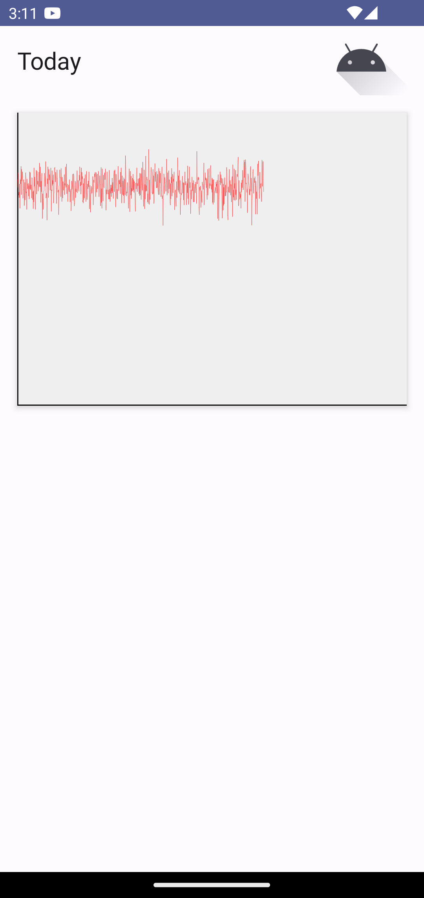

# Berlin Geiger Counter

Shows realtime gamma radiation measurements of Berlin.

### Notes

Follow me on Twitter: 

Let me know what you think: [jan.rabe@kibotu.net](mailto:jan.rabe@kibotu.net)

Contributions welcome!

### License
<pre>
Copyright 2022 Jan Rabe

Licensed under the Apache License, Version 2.0 (the "License");
you may not use this file except in compliance with the License.
You may obtain a copy of the License at

   http://www.apache.org/licenses/LICENSE-2.0

Unless required by applicable law or agreed to in writing, software
distributed under the License is distributed on an "AS IS" BASIS,
WITHOUT WARRANTIES OR CONDITIONS OF ANY KIND, either express or implied.
See the License for the specific language governing permissions and
limitations under the License.
</pre>